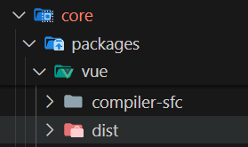
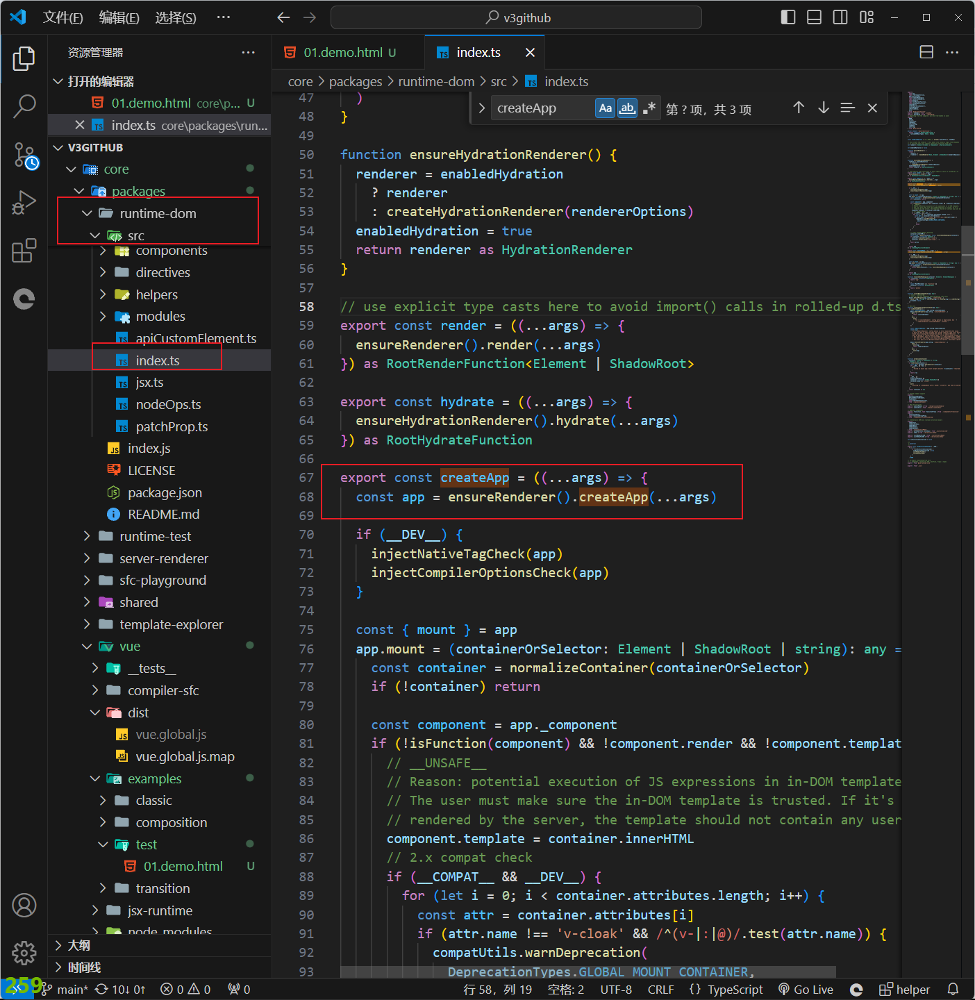
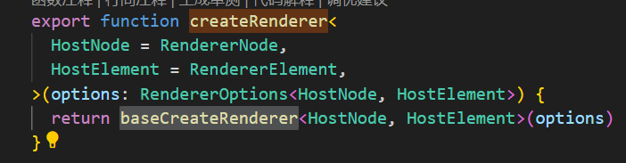

### 拉取代码
- git地址(vue3):https://github.com/vuejs/core.git
- 进入文件内,确认当前node版本,当前为v18.18.1,pnpm版本为9.3.0
- 使用pnmp安装依赖 后运行npm run dev 运行项目
- 此时可以看到 core\packages\vue
- 

- 这里打包后生成的global.js 就是我们要引入的cdn文件了

- 这里做一个示例 在浏览器运行后 可以看到和我们在工程中使用vue或者外部cdn引入vue有同样的效果

- ```html
  <!doctype html>
  <html lang="en">
    <head>
      <meta charset="UTF-8" />
      <meta name="viewport" content="width=device-width, initial-scale=1.0" />
      <title>Document</title>
      <script src="../../dist/vue.global.js"></script>
    </head>
    <body>
     <div id="app">
      <h1>{{count}}</h1>
      <button @click="count++">count++</button>
      <button @click="count--">count--</button>
     </div>
      <script >
        const app =Vue.createApp({
            data(){
              return {
                count:0
            }
            },
            methods:{},
        })
        app.mount("#app")
      </script>
    </body>
  </html>
  
  ```

### createApp

- 源码对应目录
- 

- 不同版本中对应行数可能会有所改变 位置基本不会变化 

- 在代码中我们可以看到 createApp实际是调用了ensureHydrationRenderer的createApp方法

- 在ensureHydrationRenderer中有一个短路函数判断了 是否已经存在renderer 不存在则调用createRenderer 创建renderer对象

- 在查看createRenderer函数后发现他只是返回了baseCreateRenderer函数

- 

- baseCreateRenderer的函数代码在我当前版本有两千行 这里我们先不看过程看一下返回结构

- ```js{5}
  // 返回了一个对象 其中就包含了我们查找的createApp函数
  return {
      render,
      hydrate,
      createApp: createAppAPI(render, hydrate),
    }
  ```

-  
